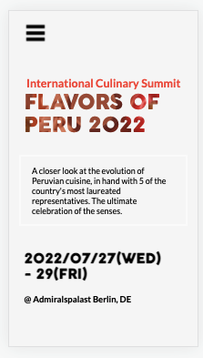
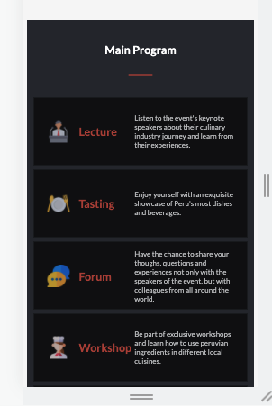

# Module-1-Capstone
A responsive web page designed for Microverse's module 1 capstone project.

Additional description about the project and its features.

## Built With

- HTML
- CSS
- JAVASCRIPT

## Live Demo

[Live Demo Link](https://karelvanoordt.github.io/Module-1-Capstone/)

## Getting Started

To get a local copy up and running follow these simple example steps.

Download the files or clone them and use them in your local environment. Also you can fork the repository and continue where you want to.

### Prerequisites

- Have a web browser installed

## Authors

👤 **Karel van Oordt**

- GitHub: [@karelvanoordt](https://github.com/karelvanoordt)
- Twitter: [@karelvanoordtEN](https://twitter.com/karelvanoordtEN)
- LinkedIn: [LinkedIn](https://linkedin.com/in/karelvanoordt)

## 🤝 Contributing

A big shoutout to my coding partners at Microverse.

Feel free to check the [issues page](https://github.com/karelvanoordt/Module-1-Capstone/issues).

## Show your support

Give a ⭐️ if you like this project!

## Acknowledgments

- Hat tip to anyone whose code was used
- Inspiration
- etc

## 📝 License

This project is [MIT](./MIT.md) licensed.